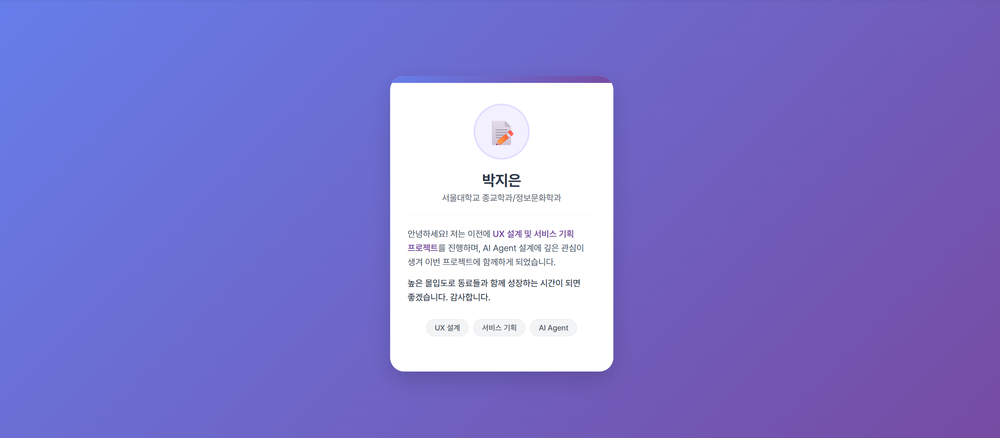

[naruv0134_박지은] - 첫 PR 공개!

## 완료 작업 목록
- [x] 바닐라 HTML, CSS를 이용한 AI Agent 자기소개 UI 페이지 구현
- [x] `work` 브랜치 생성 및 소스코드 커밋/푸시 완료
- [x] 동작 화면 스크린샷:

## 설계 과정
- about-me 파일 내에 html, css 파일을 생성
- gemini로 원하는 내용을 입력 및 세부 디자인 변경
- 터미널에서 fork 저장소로 push

## AI를 활용한 부분
- html 및 css 파일 작성
- 포크 저장소로 push하는 법 확인
- 터미널 명령 오류 해결

## 새로 알게 된 것
- 상호작용이 없는 웹페이지는 ai로 쉽게 제작 가능
- github 브랜치 및 터미널 활용방법(fork, merge, commit)